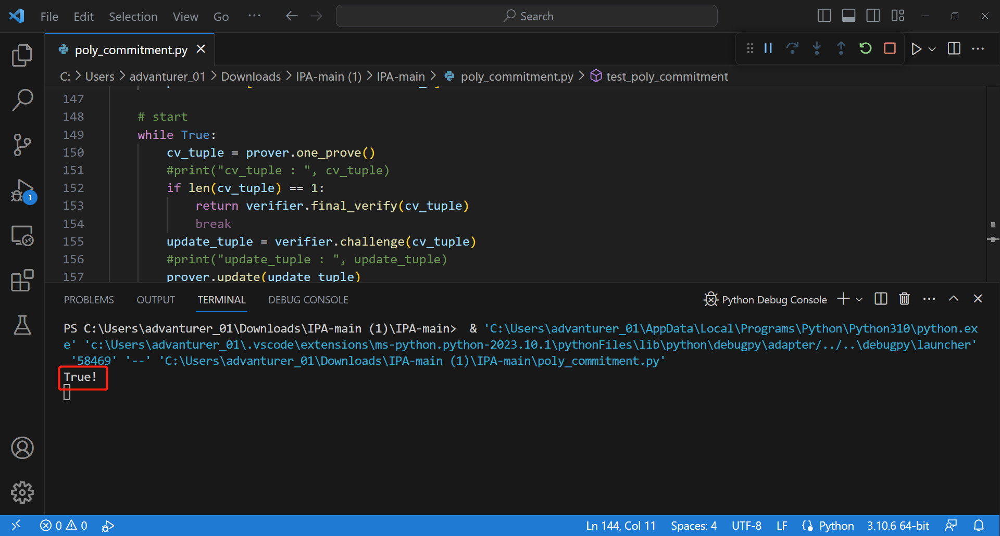

#### 一、流程概述

使用离散对数进行向量u进行多项式承诺的流程：

有一个群G，其上的离散对数关系是困难的：满足h=ag的给定的h和g，如果不知道a，a是不可计算的（在多项式时间内正确计算a的概率为negligible的）。我们称a为h对于g的离散对数。

我们实现的是椭圆曲线群，使用的参数和bitcoin一致。

Prover选择G中的一组生成元，（$g_1,g_2,...,g_n$），n为u的长度。计算承诺Cu = <u, g>。

若n = 1， 则把u发送给验证者，让其检查 $u*g=C_u$。

否则，对于 $u=u_l||u_r,g=g_l||g_r$，计算得到$v_l = <u_l, g_r>; v_r = <u_r, g_l>$ ,发送给Verifier。

验证者使用$F_p$中的随机数a回应。

进行递归，令$C_{u'} = C_u +a^2v_l + a^{-2}v_r,  u' = au_l +a^{-1}u_r; g' = a^{-1}g_l + ag_r,  n' = n/2 $。用同样的协议证明上述$C_{u'}$。

### 二、性能分析

容易看出，$u'$ 和$g'$ 每轮长度减半，因此协议在 $log_2（n）$ 轮后终止。

网络性能：每轮证明者向验证者仅发送2个群元素，验证者向证明者发送1个随机数群元素，因此网络性能为$O(logn)$。

计算性能：证明者和验证者的运行时间都由每轮更新生成元向量所需的时间支配。具体来说，为了在每轮中从$g$计算$g'$，验证者执行与$g$的长度成比例的一些群指数运算，这意味着群指数运算的总数为$O(n + n/2 + n/4 + … + 1) = O(n)$。因此，证明者和验证者整个协议的运行时间与执行O(n)个群指数运算所需的时间成比例。

### 三、Completeness与Soundness分析

Completeness是显然的，容易验证诚实的Prover可以说服Verifier。

Soundness在于Verifier选择随机数a是在Prover发送$v_l,v_r$之后。要说服Verifier，a必须是一个与$v_l,v_r$有关的四次多项式的根。因此，对于随机选择的a，欺骗的成功概率为$4/p$，这个数很小。

### 四、零知识性质

可以使用Pederson协议，使得Prover发送的信息得以完美隐藏，而Verifier仍能成功验证。

### 五、程序运行截图

为了验证我们程序的正确性，我们设计了测试函数test_poly_commitment模拟证明过程。

test_poly_commitment有一个bool参数，可以分别验证证明者意图证明的多项式和实际承诺的多项式一致和不一致的情况。

分别执行10次一致和不一致的情况，符合预期的次数若为20，则测试通过。

截图如下：

### 六、参考资料

Justin Thaler: **Proofs, Arguments, and Zero-Knowledge.** [Found. Trends Priv. Secur. 4(2-4)](https://dblp.org/db/journals/ftsec/ftsec4.html#Thaler22): 117-660 (2022) 第十二章至第十四章

【证明、论证与零知识】第十四章 基于离散对数困难性的多项式承诺（中文翻译）：https://zhuanlan.zhihu.com/p/635284288

椭圆曲线的实现：https://github.com/wycl16514/EllipticCurve-Signature